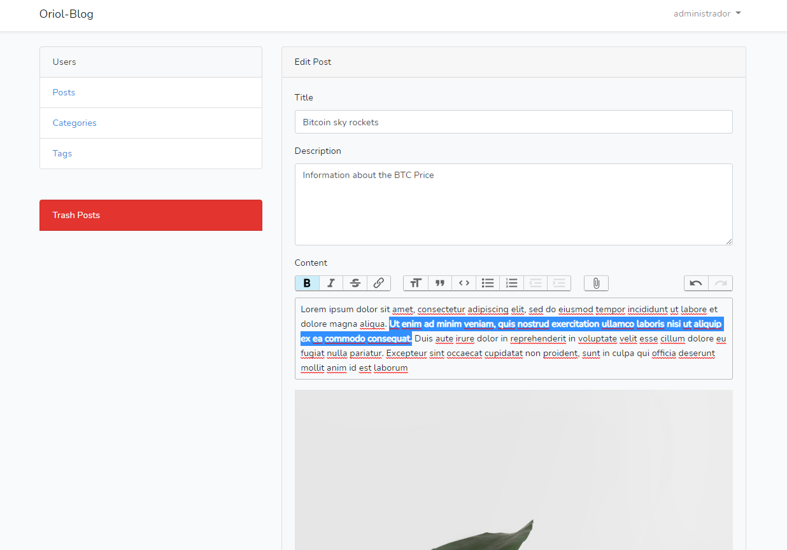

# Blog-System
This is a dynamic Blog Application. 🙂
This application named "Oriol's Blog" will have functionality from the client side and admin.

## Build with 🛠️
* [MYSQL](https://www.mysql.com) - Data Base.
* [PHP-7](https://www.php.net) - Backend Programming Language.
* [Bootstrap-4](https://getbootstrap.com) - Frontend styling framework.
* [Laravel 7.30.2](https://laravel.com) - Backend Framework.
* [Authentication](https://laravel.com/docs/7.x/authentication) - Laravel default authentication quickstart.

## Features ✔😎
* Blog contains posts, paginator, searchbar, comment section.
* Authentication to enter blog admin panel.
* Implementing laravel softdelete to trash posts.
* Admin/Users can Create-Read-Update-Delete posts, tags, categories.
* Database relationships One-to-Many with Post->Tags and Category->Posts.
* TrixEditor to write content of Post.

## Authors ✒️

* **Oriol Cortez Cesar** - [Dev-OriolCC](https://github.com/Dev-OriolCC)

## Screenshots and gifs 📸

